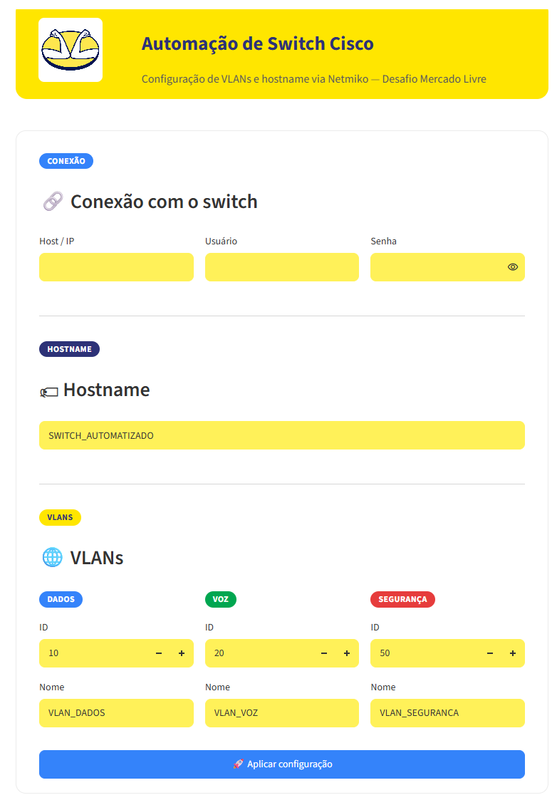

# Desafio de Automação  

Projeto desenvolvido para o desafio técnico de automação de redes.

O projeto é dividido em duas partes:

- **Parte 1**: automação de configuração de um switch Cisco (VLANs + hostname) via
  Netmiko, com frontend em Streamlit, backup automático e validação pós-configuração.
- **Parte 2**: planejamento (documentação) da automação de uma VPN IPSec entre um
  Fortigate e um Palo Alto, sem exigir implementação funcional.

## Estrutura do projeto

```
├── backend/
│   ├── automacao_switch.py   # Conexão SSH e automação via Netmiko
│   └── backup/                # Backups de configuração gerados em tempo de execução
│                               # (fora do Git — contêm hash de senha do switch)
├── frontend/
│   ├── app.py                 # Interface Streamlit
│   └── assets/                 # Logo usado no banner do frontend
├── .streamlit/
│   └── config.toml             # Tema visual do Streamlit
├── docs/
│   └── plano_vpn_ipsec_fortigate_paloalto.md   # Documento da Parte 2
├── evidencias/
│   ├── frontend/               # Screenshots do frontend
│   └── switch_cli/             # Backup de exemplo (redigido) e evidências da CLI
├── requirements.txt
├── .env                        # Credenciais reais (NUNCA vai para o Git)
└── .gitignore
```

## Pré-requisitos

- Python 3.10 ou superior
- Acesso de rede ao switch Cisco (SSH habilitado)
- Credenciais válidas de um usuário com privilégio 15 no switch

## Instalação

1. Clone o repositório e entre na pasta do projeto:
   ```bash
   git clone https://github.com/TPNETTO/desafio-automacao-ml.git
   cd desafio-automacao-ml
   ```

2. Crie e ative um ambiente virtual:
   ```bash
   python -m venv venv
   venv\Scripts\activate      # Windows
   source venv/bin/activate   # Linux/Mac
   ```

3. Instale as dependências:
   ```bash
   pip install -r requirements.txt
   ```

4. Crie um arquivo `.env` na raiz do projeto com as credenciais do switch (esse
   arquivo já está no `.gitignore` e nunca deve ser commitado):
   ```
   SWITCH_HOST=10.10.90.6
   SWITCH_USER=admin
   SWITCH_PASSWORD=sua_senha_aqui
   ```

## Como usar o frontend

Com o ambiente virtual ativo (veja "Instalação" acima), no `cmd`/PowerShell do Windows,
a partir da raiz do projeto, execute:

```bat
venv\Scripts\python -m streamlit run frontend\app.py
```

Isso sobe um servidor local. O terminal mostra algo como:

```
Local URL: http://localhost:8501
Network URL: http://<ip-da-maquina>:8501
```

O Streamlit costuma abrir o navegador padrão automaticamente. Se isso não acontecer,
abra manualmente `http://localhost:8501` em qualquer navegador (Chrome, Edge, Firefox)
**na mesma máquina** que roda o comando acima — precisa ser essa máquina porque é ela
quem tem acesso de rede ao switch (`10.10.90.6`), não o navegador em si. Para acessar de
outro computador na mesma rede, use a `Network URL` mostrada no terminal.

Para parar o servidor, volte ao terminal e aperte `Ctrl+C`.

> **Atenção:** o Streamlit reexecuta `frontend/app.py` a cada interação, mas **não**
> recarrega automaticamente módulos importados (como `backend/automacao_switch.py`).
> Se você alterar esse arquivo, um `F5` no navegador não é suficiente — pare o servidor
> (`Ctrl+C`) e rode o comando `streamlit run` de novo para a mudança valer.

O Streamlit abre uma página no navegador onde é possível:

- Informar/editar o IP e as credenciais de conexão com o switch (pré-preenchidos a
  partir do `.env`, mas editáveis na tela)
- Definir o novo hostname do switch
- Configurar até 3 VLANs, com ID e nome editáveis (vem pré-preenchido com
  10/`VLAN_DADOS`, 20/`VLAN_VOZ` e 50/`VLAN_SEGURANÇA`, mas os IDs podem ser
  alterados livremente — o formulário valida que os três IDs são diferentes
  entre si antes de aplicar)
- Clicar em **"Aplicar configuração"** para, de fato, conectar via SSH no switch e
  executar todo o fluxo: aplicar VLANs, alterar hostname, salvar na NVRAM, gerar
  backup local (com botão para baixar) e validar o resultado — cada etapa concluída
  aparece na tela em tempo real, e qualquer divergência na validação é destacada
  como alerta

Exemplo do formulário rodando localmente (`http://localhost:8501`):



## Notas de implementação

- A automação usa [Netmiko](https://github.com/ktbyers/netmiko) (`device_type
  cisco_ios`) para conexão SSH com o switch.
- Após aplicar a configuração, ela é salva na NVRAM (`copy running-config
  startup-config`) e um backup local é gerado com o nome do host + data/hora.
- A validação relê a configuração do switch após a aplicação e compara com o
  esperado (VLANs e hostname), sinalizando qualquer divergência.
- Credenciais nunca ficam hardcoded no código — são lidas do `.env` via
  `python-dotenv`.
- Os backups reais (`backend/backup/*.txt`) ficam fora do Git de propósito: o
  `show running-config` do switch inclui o hash da senha do usuário admin
  (`secret 9 ...`), que não deve ir para um repositório público. Um exemplo real
  já aplicado, com esse hash removido, está em
  `evidencias/switch_cli/SWITCH_AUTOMATIZADO_backup_exemplo.txt` como evidência do
  entregável.

## Comandos aplicados no switch

Ao clicar em "Aplicar configuração", o backend ([`backend/automacao_switch.py`](backend/automacao_switch.py))
envia estes comandos via SSH (Netmiko, `device_type=cisco_ios`), na ordem abaixo,
usando os valores preenchidos no formulário:

| Etapa | Comandos enviados ao switch |
|---|---|
| Configurar cada VLAN | `vlan <id>` seguido de `name <nome>` (repetido para cada VLAN) |
| Alterar hostname | `hostname <novo_hostname>` |
| Salvar na NVRAM | `write mem` (equivalente a `copy running-config startup-config`) |
| Gerar backup | `show running-config` (saída salva em `backend/backup/<hostname>_<data_hora>.txt`) |
| Validar após aplicar | `show vlan brief` (conferido contra os IDs/nomes esperados) |
| Teste de conexão (`python backend\automacao_switch.py`) | `show version` (não altera nada no switch) |

## Comandos úteis via terminal (cmd/PowerShell)

Todos a partir da raiz do projeto, com o ambiente virtual já criado:

```bat
:: Ativar o ambiente virtual
venv\Scripts\activate

:: Instalar/atualizar dependências
pip install -r requirements.txt

:: Testar só a conexão SSH com o switch, sem alterar nada (usa as
:: credenciais do .env e executa "show version")
python backend\automacao_switch.py

:: Subir o frontend Streamlit
streamlit run frontend\app.py

:: Sair do ambiente virtual
deactivate
```

## Solução de problemas

- **"Router prompt not found" ou hostname aparece truncado após aplicar**: normalmente
  sinal de que o servidor Streamlit ainda está com uma versão antiga do backend
  carregada em memória (ver aviso na seção "Como usar o frontend" acima) — pare com
  `Ctrl+C` e rode `streamlit run` de novo.
- **"As três VLANs precisam ter IDs diferentes entre si"**: o formulário bloqueia o
  envio se dois campos de ID de VLAN tiverem o mesmo número; ajuste os IDs e tente
  novamente.
- **Erro de autenticação/timeout ao aplicar**: confira host, usuário e senha no
  formulário (ou no `.env`), e se a máquina que roda o Streamlit tem acesso de rede ao
  switch na porta 22 (SSH).

## Status

- Parte 1 (automação do switch): frontend integrado ao backend e testado contra o
  switch físico (Catalyst 2960-X, `10.10.90.6`) — VLANs, hostname, salvamento em
  NVRAM, backup e validação funcionando de ponta a ponta.
- Parte 2 (planejamento de VPN IPSec): documento ainda **pendente** — será
  adicionado em `docs/plano_vpn_ipsec_fortigate_paloalto.md`.
